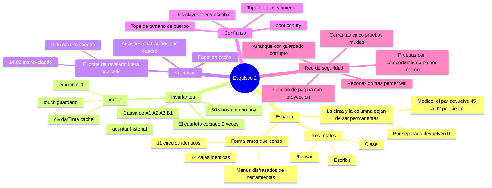
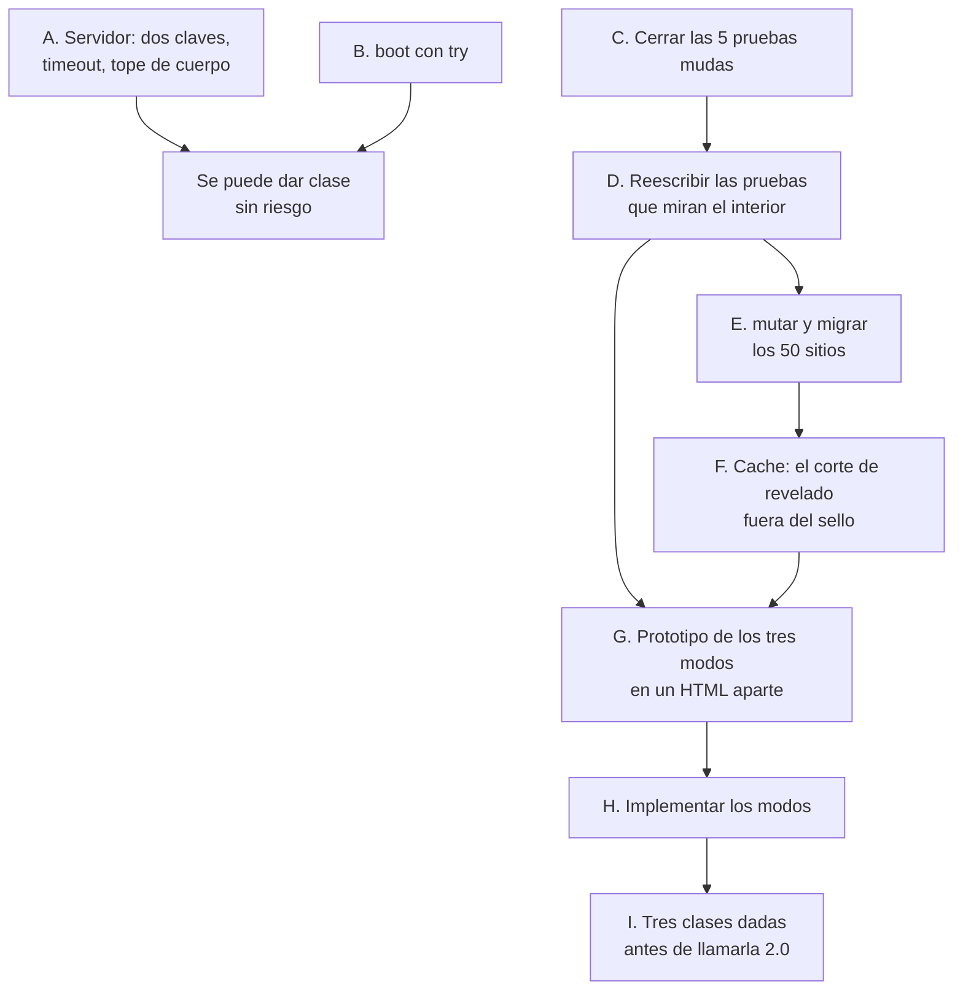

# Esquisse 2

Plan de escritura. Sale de cinco auditorías independientes sobre el código de
la versión 1 (estructura, arquitectura, seguridad, pruebas y pantalla) y de
verificar a mano cada afirmación que decide algo. Los números de este documento
están medidos, no estimados. Donde hay una estimación se dice.

La versión 1 queda congelada en la etiqueta `v1-final`. Se vuelve a ella con

```
git checkout v1-final -- pizarron.html pizarron_servidor.py
bash crear_app_mac.sh
```

---

## 0. Qué es la versión 2, y qué no

**No es una reescritura.** Se consideró y se descartó con evidencia, no por
prudencia. Dos razones.

La primera es que ninguno de los defectos conocidos de la versión 1 es un
problema de navegación por el código. Ninguno dice «no encontré dónde estaba»
ni «toqué esto y rompí aquello sin verlo». Todos son de comportamiento. Partir
el archivo resuelve el problema de encontrar cosas, y ese problema no existe
aquí.

La segunda es más dura. Las 40 pruebas entran a la página y llaman a 27
identificadores globales de la aplicación, con unas 500 referencias.
`prueba_cache.mjs` compara el pizarrón píxel a píxel contra un rasterizado de
cero llamando a `olvidarTinta()` y `drawBoard()` desde dentro. Si el corte se
hace con módulos de JavaScript, esas 500 referencias dejan de resolver el mismo
día y el contrato de comportamiento desaparece justo durante la reescritura,
que es cuando más falta hace. Si algún día se parte el archivo, tiene que ser
por concatenación a un `<script>` clásico, que conserva el ámbito global.

**Sí es una versión 2** en tres cosas que sí cambian de raíz: dónde vive la
interfaz, cómo se garantizan las invariantes del documento, y quién puede
escribir en la clase.

---

## 1. Lo que se midió

### 1.1 El pizarrón ocupa menos de la mitad de la pantalla

Estado de fábrica, con emulación táctil en los dos iPad, que es lo que dispara
la regla de 44 px de tamaño mínimo de toque.

| | iPad 11" | iPad 12.9" | portátil | 1920 |
|---|---|---|---|---|
| barra | 108 px, dos filas | 108 px, dos filas | 48 px | 48 px |
| cinta de trazos | 161 px | 161 px | 147 px | 147 px |
| columna lateral | 224 px de ancho | 224 px | 224 px | 224 px |
| **área de escritura** | **887×499** | 1090×613 | 1236×695 | 1481×833 |
| **% de la pantalla** | **45.7 %** | 47.8 % | 60.1 % | 59.5 % |

En el iPad de 11 pulgadas las barras se llevan el 45.6 %, casi tanto como el
pizarrón entero. Y la fila de herramientas, que el código exige que quepa en
una línea, cabe en el portátil y **no cabe en ninguno de los dos iPad**, porque
la prueba que lo comprueba corre sin emulación táctil.

### 1.2 Los recortes parciales no devuelven nada

Aquí está el hallazgo que reordena todo lo demás.

| iPad | quitar solo la columna | quitar solo la cinta | quitar las dos |
|---|---|---|---|
| 11" | **+0 %** | +4 % | **+62 %** |
| 12.9" | +31 % | **+0 %** | **+45 %** |

En el de 11 pulgadas el pizarrón está limitado por el alto, así que quitar los
224 px de ancho de la columna no devuelve un solo píxel. Al quitar la cinta
pasa a estar limitado por el ancho, y por eso tampoco devuelve casi nada. En el
de 12.9 pulgadas pasa exactamente al revés.

Las dos restricciones se alternan. **Cualquier recorte que atienda una sola no
sirve para nada.** Es la razón por la que los menús desplegables, que
devolvieron 50 px de alto, no agrandaron el pizarrón ni un píxel en ninguno de
los dos iPad.

### 1.3 La caché de tinta se apaga en la función insignia

Cuatrocientos trazos en una página, tiempo por cuadro de `drawBoard`:

| Situación | ms |
|---|---|
| Escribiendo, con el revelado al final | **0.05** |
| «Escribir hasta el stop», o arrastrar la cinta | **14.08** |
| Sin caché en absoluto, de referencia | 11.40 |

El presupuesto de un cuadro a 60 Hz son 16.7 ms. Durante la reproducción la
caché no solo deja de servir, **cuesta más que no tenerla**, porque paga la
contabilidad y re-rasteriza la página entera igual.

La causa está en `renderTo`. Hay cuatro capas: tinta revelada, tinta fantasma,
marcador revelado y marcador fantasma. Cada elemento entra en una u otra según
esté antes o después del corte de revelado. Cuando el corte avanza, los
elementos que cruza tienen que **cambiar de capa**, y una capa rasterizada no
se puede deshacer. El sello de la caché incluye el corte, así que la única
salida es limpiar las cuatro y empezar de nuevo.

Esto se dispara en cuatro flujos reales: arrastrar la cinta, «escribir hasta el
stop», saltar entre stops, y cada trazo insertado con «Editar aquí».

### 1.4 Cualquier alumno puede borrar la clase

Verificado en vivo. Seis trazos escritos como profesor, y desde fuera, con la
clave que lleva el enlace de cualquier alumno:

```
POST /empujar  {"t":"page","page":{"items":[],"paper":"negro",...}}
respuesta: 200
proyección antes:   6 trazos, papel blanco
proyección después: 0 trazos, papel negro
alumno que llega tarde: 0 trazos, papel negro
```

El rol vive solo en el navegador. Para el servidor, «alumno» y «control» son
idénticos, y `/empujar` reenvía cualquier objeto JSON a todo el mundo. El
servidor además guarda ese mensaje como último estado, así que la página
envenenada se le sirve a quien se conecte después. Con `t:'soy'` se pueden
inyectar participantes falsos o suplantar las iniciales de otro.

Como la clave nunca rota, quien guarde la foto del código QR conserva ese
acceso el semestre siguiente.

### 1.5 Cinco pruebas no comprueban nada

`prueba_persistencia.mjs`, `prueba_calibracion.mjs`, `prueba_marcador.mjs`,
`prueba_captura.mjs` y `prueba_formula_visual.mjs` no tienen ni una sola
aserción. Imprimen un veredicto en texto y siempre salen con código cero.
`correr.sh` solo marca fallo si el proceso sale distinto de cero o si la última
línea dice « fallidas» con número.

`prueba_persistencia.mjs` puede imprimir `SE PIERDE EL TRABAJO` y el corredor
dirá «todo en verde». Es la que vigila la pregunta más cara de todas.

Corridas a mano, las cinco pasan. Lo que está roto es la red, no el producto.

### 1.6 El arranque muere en silencio con el guardado local mal formado

| Caso sembrado en `localStorage` | El pizarrón abre | Enlace con el iPad |
|---|---|---|
| `index` es un objeto y no un arreglo | sí, se ve normal | **no conecta** |
| Un cuaderno con un elemento nulo | sí, se ve normal | **no conecta** |
| JSON cortado a la mitad | sí | sí |

`boot()` no tiene `try`. Cuando revienta a mitad, se lleva por delante
`conectar()`, `fitAll()`, `refreshLook()` y `sync()`. La aplicación se ve bien,
los botones están, y nada se conecta. Es el peor tipo de fallo en un aula,
porque no da síntoma.

---

## 2. El mapa



Y el orden de dependencias, que es lo que decide en qué orden se trabaja:



La flecha que importa es **D antes que E, F y H**. Reescribir las pruebas en
términos de comportamiento antes de tocar nada es lo que hace segura toda la
ruta. Si se cambia la caché primero, `prueba_cache.mjs` deja de compilar y se
pierde el invariante que protege justo cuando se está tocando.

---

## 3. Las tres decisiones

### 3.1 La cinta y la columna dejan de ser permanentes

Las medidas de 1.2 obligan a tratarlas como una sola cosa. Y el reparto es
absurdo cuando se mira de cerca: los 33 controles de la barra cuestan 108 px,
los 12 de la cinta cuestan 161, y los 2 elementos interactivos de la columna
cuestan 224 de ancho. **El bloque con más controles es el más barato y el que
menos tiene es el más caro.**

Los doce controles de la cinta son de reproducción, es decir del momento
contrario a escribir. Ninguno se toca a media frase. La columna tiene siete
filas de estadísticas, una nota de ayuda de 99 px y un bloque de atajos de 132
px, todo texto que se lee una vez y se queda para siempre.

**Tres modos**, porque preparar una clase y darla son dos actividades distintas
con necesidades distintas:

| Modo | Qué se ve | Para qué |
|---|---|---|
| **Escribir** (de fábrica) | Pizarrón y una fila de barra. Una tira de 12 px abajo dice en qué punto vas | Escribir la clase |
| **Revisar** | Añade la cinta entera y la columna | Marcar stops, reordenar páginas, comprobar el encuadre |
| **Clase** | Dock de una fila | Dar la clase |

Se cambia con un botón y con una tecla. La tira de 12 px conserva lo único de
la cinta que sirve mientras escribes, que es saber por dónde vas.

Riesgo declarado: se pierde arrastrar el cursor de reproducción sin abrir nada,
y abrir la lupa de un toque si acaba en el menú. Ese es el motivo del prototipo
de la etapa G.

### 3.2 Toda mutación del documento pasa por un sitio

Hoy, cada vez que algo cambia el documento hay que llamar a mano y en el orden
correcto hasta cuatro funciones de contabilidad. `apuntar()` para el historial,
`edicion()` para reenviar por red, `olvidarTinta()` para invalidar la caché y
`touch()` para guardar. Están repartidas por unos cincuenta sitios y el cuarteto
literal está copiado nueve veces.

Olvidar una no da error. Da una clase congelada, o un deshacer que borra otra
página. El propio `CONTEXTO.md` lo tiene declarado por escrito como riesgo
asumido, y es la causa raíz compartida por cuatro defectos de la auditoría de
septiembre.

Son quince líneas, no una carpeta.

### 3.3 El corte de revelado sale del sello de la caché

Es la causa de los 14 ms de 1.3. Dos caminos posibles, y el prototipo decide:

**Camino A, dos capas por rango.** La capa revelada guarda los elementos
`[0, corte)` y crece por añadido, que es gratis. La capa fantasma guarda
`[corte, n)` y se rehace cuando el corte se mueve. Correcto seguro, pero
durante la reproducción la capa fantasma se rehace en cada paso, y al principio
de la clase es casi la página entera.

**Camino B, una capa completa más un prefijo.** Se rasteriza la página entera
una vez, con un sello que **no** incluye el corte, y aparte el prefijo revelado,
que crece por añadido. Al componer, la capa completa va con la opacidad de
fantasma y el prefijo encima con opacidad plena. El coste por cuadro pasa a ser
proporcional a los elementos recién revelados, que es prácticamente nada.

El riesgo de B es que un elemento revelado se dibuja dos veces, una tenue
debajo y otra plena encima. Con tinta opaca la de encima cubre exactamente. Con
el marcador, que se compone con transparencia, los bordes quedarían algo más
oscuros. Eso hay que verlo en pantalla antes de decidir, y es exactamente lo
que `prueba_cache.mjs` detectaría. De ahí que su reescritura vaya antes.

---

## 4. Pseudocódigo

### 4.1 `mutar`

```
mutar(cambio, opciones):
    # el historial va ANTES de tocar nada, o guarda el estado ya cambiado
    si opciones.historial no es falso:
        si opciones.nada_que_hacer():        # comprobar primero
            devolver                          # sin apuntar, sin ensuciar
        apuntar(opciones.todas_las_paginas)

    resultado = cambio()

    # edicion() ya llama a olvidarTinta(); llamarlo aparte solo sube el
    # contador dos veces, que es lo que hoy pasa en doce sitios
    si opciones.solo_anade_al_final no es cierto:
        edicion()

    touch()
    sync()
    devolver resultado
```

Uso, comparado con lo que hay hoy:

```
# hoy, en selGirar
apuntar()
para cada i en sel: girarItem(items()[i], angulo)
edicion(); olvidarTinta(); touch(); sync()

# con mutar
mutar(() => { para cada i en sel: girarItem(items()[i], angulo) },
      { nada_que_hacer: () => sel.longitud === 0 })
```

La comprobación previa arregla de paso un defecto real. Hoy `selApplyColor`,
`selScale`, `selCut`, `selDelete`, `paste` y `quitarUltimos` llaman `apuntar()`
**antes** de comprobar si hay algo que hacer, así que unos cuantos toques en
vacío empujan fuera de la pila pasos de deshacer buenos.

### 4.2 La caché, camino B

```
renderTo(contexto, camara, ancho, alto, cuenta, parcial, clave, corte):

    dibujarPapel(...)                 # desde 4.3, ya cacheado

    # el sello del raster completo NO lleva el corte
    sello = [ancho, alto, camara, oscuro, version_doc, pagina]
    previo = cache.obtener(clave)

    sirve = previo y previo.sello === sello y no parcial y cuenta >= previo.n
    desde = sirve ? previo.n : 0
    si no sirve: limpiar(capa_completa)

    # 1. el raster completo, por añadido
    para i desde 'desde' hasta cuenta:
        pintar(capa_completa, elementos[i])
    cache.guardar(clave, {sello, n: cuenta})

    # 2. el prefijo revelado, también por añadido, con su propio recuerdo
    prefijo = cache_revelado.obtener(clave)
    sirve_p = prefijo y prefijo.sello === sello y corte >= prefijo.corte
    desde_p = sirve_p ? prefijo.corte : 0
    si no sirve_p: limpiar(capa_revelada)

    para i desde 'desde_p' hasta corte:
        pintar(capa_revelada, elementos[i])
    cache_revelado.guardar(clave, {sello, corte})

    # 3. componer, con el recorte al marco donde ya estaba
    recortar_al_marco(contexto)
    dibujar(capa_completa,  opacidad: fantasma)
    dibujar(capa_revelada,  opacidad: plena)
```

El caso que hoy cuesta 14 ms, avanzar el corte, aquí solo pinta los elementos
que el corte acaba de cruzar. Retroceder el corte sigue costando un rehacer del
prefijo, que es correcto y ocurre mucho menos.

### 4.3 El papel en caché

Hoy `drawPaper` corre entero en cada cuadro, antes y al margen de la caché de
tinta. Por cuadro hace un degradado radial, la rejilla de guías (hasta unos 950
arcos con guía de puntos) y, en los tres pizarrones lisos, un bucle de ruido de
unas 11 400 iteraciones. Multiplicado por los lienzos activos.

```
dibujarPapel(contexto, camara, ancho, alto, guia, pagina):
    sello = [ancho, alto, camara, papel, guia, tamano_guia, color_fondo, id_fondo]
    si capa_papel.sello === sello:
        dibujar(capa_papel); devolver

    limpiar(capa_papel)
    pintar_color_o_textura(capa_papel)
    # el ruido del gis es estatico: un mosaico de 14x14 generado una vez
    si es_pizarron_liso: dibujar_patron(mosaico_ruido)
    pintar_rejilla(capa_papel)
    capa_papel.sello = sello
    dibujar(capa_papel)
```

### 4.4 Los arrastres, coalescidos por cuadro

El camino del marcador y la goma ya usa este patrón. El de la selección y el
del fondo no, y redibujan en cada `pointermove`, o sea hasta 120 veces por
segundo con el Pencil.

```
alMoverPuntero(evento):
    si arrastrando_seleccion:
        mover_elementos(dx, dy)
        sucio = cierto
        si no hay cuadro_pedido:
            cuadro_pedido = pedir_cuadro(() => {
                cuadro_pedido = nulo
                si sucio: olvidarTinta(); dibujarPizarron(); dibujarProyeccion()
                sucio = falso
            })
        devolver
```

Y `refreshSelBar` lee el ancho y el alto de la barra **entre** dos escrituras
de su posición, que fuerza recalcular la disposición en cada evento. Se mide
una vez al abrirla.

### 4.5 Dos claves en el servidor

```
al arrancar:
    clave_escribir = leer_o_generar('.clave-escritura')   # rota cada arranque
    clave_leer     = leer_o_generar('.clave-lectura')     # estable, para el icono

autorizado(peticion, nivel):
    si es_local(peticion): devolver cierto
    k = clave_de(peticion)
    si nivel es ESCRIBIR:  devolver comparar_constante(k, clave_escribir)
    devolver comparar_constante(k, clave_escribir) o comparar_constante(k, clave_leer)

rutas:
    GET  /eventos, /cuadernos*, /info     -> LEER
    POST /empujar, /fondos, /cuadernos    -> ESCRIBIR
    PUT, DELETE /cuadernos                -> ESCRIBIR

    # y el filtro que a do_DELETE le falta hoy
    DELETE: si nombre no acaba en .json o empieza por punto: 404

leer_cuerpo(peticion):
    n = entero(cabecera Content-Length)
    si n no es entero, o n < 0, o n > TOPE:      # 32 MB
        responder 413; cerrar_conexion; devolver vacio
    devolver leer(n)

servidor:
    Manejador.timeout = 20                        # corta lectores muertos
    semaforo = acotado(64)                        # tope de conexiones
```

El código QR del control lleva la clave de escritura. El enlace que se reparte
a los alumnos lleva solo la de lectura. El icono de la pantalla de inicio del
iPad sigue funcionando porque su clave es la estable.

### 4.6 El arranque tolerante

```
boot():
    intentar:
        indice = leer('index')
        si no es un arreglo: indice = []
        ...
    si falla:
        avisar_en_consola(error)
        state.nb = cuaderno_nuevo()          # seguir con uno en blanco

    # esto va SIEMPRE, pase lo que pase arriba
    finalmente:
        fitAll(); refrescarAspecto(); setTool('pen'); conectar(); sync()
```

Lo importante no es recuperar el cuaderno roto. Es que `conectar()` corra
siempre, porque hoy un cuaderno roto deja el iPad sin enlace y sin aviso.

---

## 4bis. Lo que se hizo, y en qué cambió lo planeado

| # | Etapa | Estado |
|---|---|---|
| A | Servidor: dos claves, filtro en `DELETE`, tope de cuerpo, timeout, tope de conexiones, clave fuera del log | **hecha**, verificada con el ataque real desde la red |
| B | `boot()` tolerante | **hecha**, 16 comprobaciones |
| C | Las cinco pruebas mudas, y el corredor estricto | **hecha** |
| D | Pruebas por comportamiento, reconexión, bibliotecas de disco | **hecha**, 13 comprobaciones de reconexión |
| E | `mutar()` y la migración | **hecha** en los sitios atómicos |
| F | Caché, papel, arrastres | **hecha** la caché; el papel resultó costar 0 ms |
| G+H | Los tres modos | **hechos**, 34 comprobaciones |
| I | Tres clases dadas antes de llamarla 2.0 | pendiente, y es tuyo |
| — | Bordes de la hoja, lupa e identificación académica | **hechas**, 45 comprobaciones nuevas |

Tres cosas salieron distintas de lo previsto y conviene apuntarlas.

**El papel no era un problema.** El plan decía que `drawPaper` corría entero en
cada cuadro con hasta 950 arcos y un bucle de ruido de 11 400 iteraciones.
Medido: **0 ms**. El bucle de ruido solo entra en tres pizarrones lisos y la
rejilla densa solo con guía de puntos, así que en el uso normal no cuesta nada.
Cachearlo habría sido trabajo tirado. La estimación del plan estaba hecha a
mano sobre el caso peor y el caso peor no es el que se usa.

**La prueba de reconexión encontró tres defectos, no uno.** Estaba escrita para
comprobar que la recuperación funciona, y la recuperación funcionaba. Lo que no
funcionaba era enterarse: al caerse el wifi la conexión no da error, se queda
colgada. De ahí salieron el latido como mensaje, el aviso por empujones
fallidos y el aviso de proyección caída.

**La vigilancia del silencio rompió la recuperación al escribirla**, y la
propia prueba lo cazó en el mismo turno. Marcar el canal como muerto sin
reabrirlo dejaba de enviar y, como una conexión colgada nunca da error, el
navegador tampoco la reintentaba. Es exactamente el motivo por el que la etapa
D va antes que la E y la F.

## 5. La ruta

Cada etapa deja el programa funcionando y `./correr.sh` en verde. Se pueden dar
clases en cualquier punto.

| # | Etapa | Reversible | Por qué en este sitio |
|---|---|---|---|
| **A** | Servidor: dos claves, filtro en `DELETE`, tope de cuerpo, timeout y tope de conexiones, clave fuera del log | sí | No toca el HTML y cierra lo único que un alumno puede usar hoy para tumbar una clase |
| **B** | `boot()` con `try`, y que `conectar()` corra siempre | sí | Tres líneas. Cierra el fallo sin síntoma |
| **C** | Cerrar las cinco pruebas mudas, y que `correr.sh` exija línea de resumen | sí | Sin esto el 12 % del contrato es decorativo |
| **D** | Reescribir por comportamiento las pruebas que miran el interior, empezando por `prueba_cache.mjs` | sí | **Antes que E, F y H.** Es lo que hace segura toda la ruta |
| **E** | Añadir `mutar()` sin usarla, y migrar los cincuenta sitios en tandas de tres, con las pruebas entre cada tanda | sí, por tanda | Cada tanda es un commit revisable a mano |
| **F** | La caché sin el corte de revelado, el papel en caché, los arrastres coalescidos | sí | Con las pruebas de D ya reescritas |
| **G** | Prototipo de los tres modos en un HTML aparte, sin tocar la aplicación | sí | Prototipar antes de implementar |
| **H** | Implementar los tres modos | **no del todo** | Cambia dónde vive cada control y el músculo de la mano ya está entrenado |
| **I** | Tres clases dadas antes de llamarla 2.0 | | La prueba real no la da `correr.sh` |

Añadidos que caben en cualquier hueco, ordenados por lo que estorban hoy:

- El solapamiento del panel de fondo. `on('fondoPanelBtn')` quita `conTrazo`
  pero no quita `conFormas` ni `conPuntero` ni cierra los menús. Con las
  opciones de puntero abiertas, tres de las ocho miniaturas de papel quedan
  enterradas e inalcanzables.
- Importar un archivo no olvida el historial, así que un deshacer justo después
  pega el contenido del cuaderno anterior sobre el recién importado.
- Ninguna ruta de abrir cuaderno limpia las firmas de las miniaturas.
- `selApplyColor`, `selScale` y `selGirar` acceden a la lista sin comprobar que
  el índice exista.
- `pruebas/package.json` documenta el puerto 8777, que es el de las clases de
  verdad, y sus guiones saltan el aislamiento de `correr.sh`.

---

## 6. Lo que no se toca

Un solo archivo, sin build. Si algún día se parte, por concatenación a un
`<script>` clásico, nunca con módulos de JavaScript.

El documento como lista ordenada de elementos con el stop como índice. De ahí
salen gratis la reproducción, el PDF por etapas, la cinta y el lazo.

Las dos cámaras independientes. El zoom privado no es una función, es la
consecuencia de no acoplarlas.

La ranura de pigmento en vez de un color literal.

La transparencia aplicada al componer y no trazo por trazo, con su comentario
que explica que por trazo salen bandas y que ya pasó una vez.

Los comentarios de causa. Casi cada decisión no obvia lleva el defecto que la
motivó y muchas veces el número medido. Eso es lo que hace que un archivo de
4800 líneas siga siendo mantenible por una persona. Conservarlo aunque cueste
líneas.

Y las cuarenta entradas concretas que la auditoría estructural documentó una
por una, desde el `finally` del elemento prestado de la goma hasta los tres
píxeles de separación de la fila de herramientas.

---

## 7. Cómo sabremos que salió bien

| | versión 1 | objetivo | **resultado** |
|---|---|---|---|
| Pizarrón en el iPad de 11" | 887×499, 45.7 % | por encima del 70 % | **1128×635, 74 %** |
| Pizarrón en el iPad de 12.9" | 1090×613, 47.8 % | por encima del 65 % | **1314×739, 69.4 %** |
| Pizarrón en el portátil | 1236×695, 60.1 % | | **1460×821, 83.9 %** |
| Cuadro de «escribir hasta el stop», 400 trazos | 20 ms | por debajo de 2 ms | **5.5 ms** |
| `drawBoard` en ese cuadro | 15.5 ms | | **2.8 ms** |
| Un alumno puede sobrescribir la clase | sí | no | **no** |
| Un cuaderno mal guardado deja el iPad sin enlace | sí | no | **no** |
| Al caerse el wifi, alguien avisa | no | sí | **sí, los tres modos de caída** |
| Archivos de prueba que pueden fallar | 35 de 40 | todos | **todos** |
| Sitios que mantienen las invariantes a mano | ~50 | 0 | 12 de mutación atómica migrados; quedan los de gesto, que no son atómicos |

El objetivo de los 2 ms por cuadro no se alcanzó y no hacía falta: 5.5 ms
caben de sobra en los 16.7 de un cuadro a 60 Hz, y lo que queda es el papel y
la composición, no la tinta. Bajar de ahí sería optimizar lo que ya no se
nota.

Y la que no se mide con números: tres clases dadas con ella antes de llamarla
2.0.

---

## 8. Preguntas abiertas

De estas depende parte del diseño y solo las puede contestar el autor.

1. ¿La reproducción «escribir hasta el stop» se siente lenta en clase con una
   página cargada? Si es que sí, 1.3 es la causa.
2. ¿Has visto miniaturas que no corresponden después de cambiar de cuaderno?
3. La cámara de proyección por página, ¿se conserva por si vuelve la idea de
   una cámara que se pasea, o es residuo? De ello depende si el modelo lleva
   una cámara o dos.
4. ¿Sigue siendo un caso de uso abrir el archivo con doble clic sin servidor?
   Si no, sobran unas cuarenta líneas y se simplifica el arranque.
5. Hay una viñeta escrita en el código que ningún papel activa. ¿Se quedó a
   medias o se apagó a propósito?
6. En modo clase, ¿cambias de color con el dock? De la respuesta depende si el
   dock puede bajar a una fila quitando los ocho colores duplicados.
